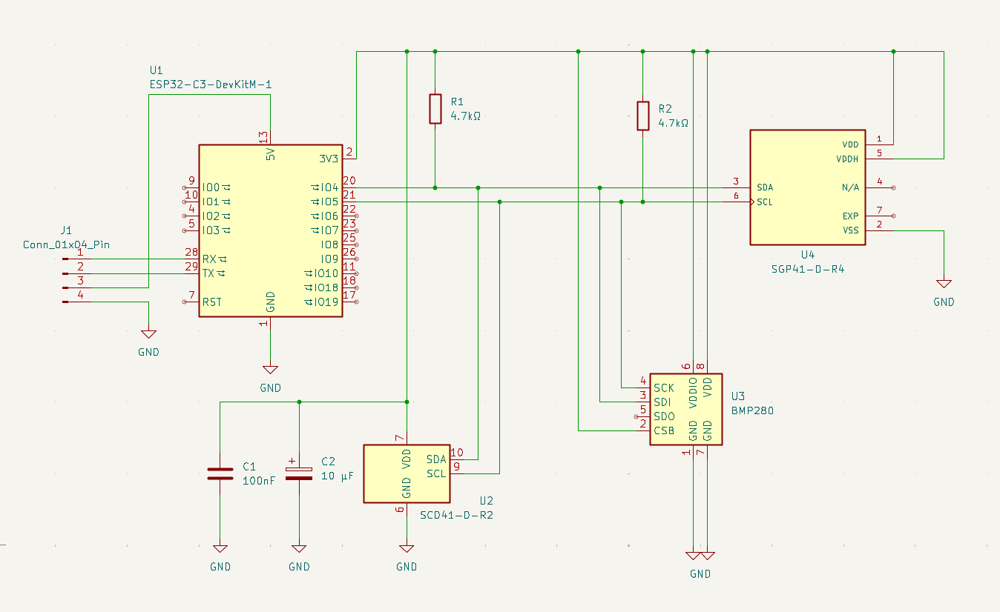
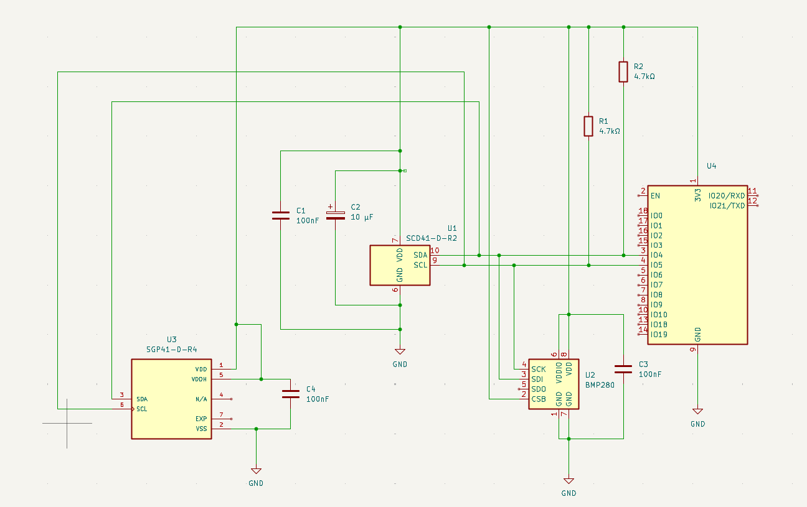

# 🔬 Pocket Air Lab LITE ポケット
<p align="left">
  
  
  
  
  
  
</p>
A compact, battery-powered pocket air quality monitor built around the ESP32-C3 on PCB.

> **Status:**  Hardware design & firmware in progress.

## Features
- **CO2, Temperature & Humidity:** Sensirion SCD41
- **VOC & Indoor Chemistry:** Sensirion SGP41
- **Atmospheric Pressure:** BMP280
- **Display & UI:** 1.3" OLED with button control & power-saving mode
- **Connectivity:** Bluetooth Low Energy (BLE) data logging to Excel
- **Expansion Port:** 4-pin UART (2.54mm pitch) for external sensors (for example: PMS5003)

---

## 📁 Repo Structure

```text
pocket-air-lab-lite/
│
├── images/           <- images for readme
├── firmware/         <- ESP32 source code
├── hardware/         <- PDF schematics, and PCB renders
├── gerbers/          <- gerber files for PCBWay 
└── README.md         <- project description
```

---

## 🛠️ Hardware & Schematics

### 1. Carrier Board Version - *we are using*
This is the main and recommended schematic for this project. It is designed as a baseboard (carrier board) where you simply plug in a pre-built, miniature **ESP32-C3 development board featuring a built-in 0.42" OLED display**. 



---

### 2. "Barebone" Version (WROOM-02 Module)
This schematic is based on the bare **ESP32-C3-WROOM-02** microcontroller module.
* **⚠️ Important:** This schematic only shows the basic sensor wiring. For the circuit to work on a custom PCB, you must manually route 5V power to the UART pins, and add a USB-C receptacle, a voltage regulator (3.3V LDO), boot circuitry (resistors/capacitors on the EN pin), and a connector for an external OLED screen.



---

## 🤝 Sponsorship
Sponsored by **[PCBWay](https://www.pcbway.com)**, who support us in manufacturing our custom PCBs.

<div align="left">
  <a href="https://www.pcbway.com/" target="_blank">
    
  </a>
</div>


---

## 👥 Contributors

* **[TheAbsurdator](https://github.com/TheAbsurdator)**
  
* **[kkastinger](https://github.com/kkastinger)** 
